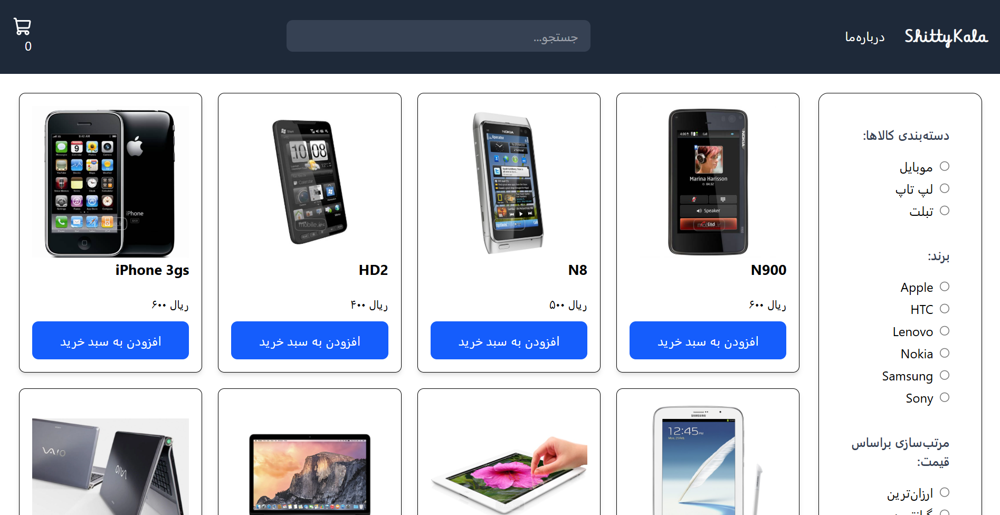
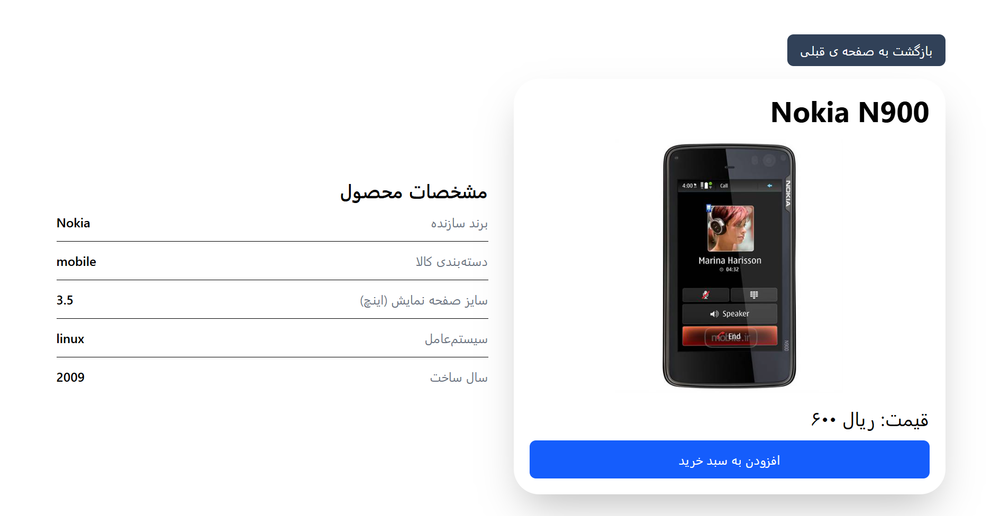
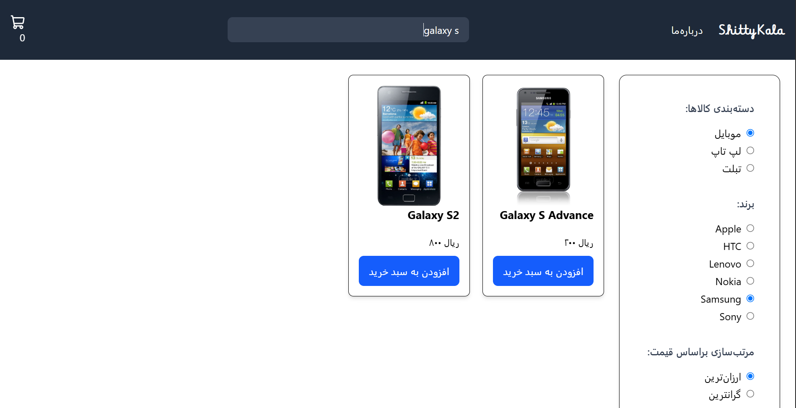
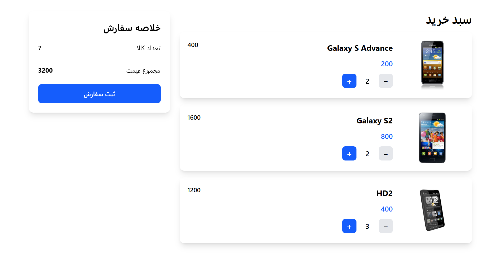
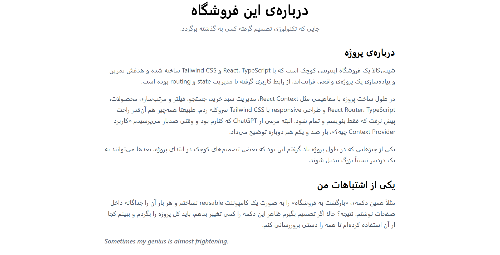

# ShittyKala

یک فروشگاه اینترنتی کوچک که با React، TypeScript، Tailwind CSS و React Router ساخته شده.

## Live Demo

https://alirezavfc.github.io/mini-ecom/

## درباره‌ی پروژه

این پروژه را برای تمرین و تجربه‌ی ساخت یک پروژه‌ی کامل فرانت‌اند از ابتدا ساختم.

در پروژه قابلیت‌هایی مثل جستجوی محصول، فیلتر و مرتب‌سازی، صفحه‌ی جزئیات
محصول و سبد خرید پیاده‌سازی شده است.

در طول پروژه با React Context، React Router، TypeScript و Tailwind CSS
کار کردم و در کنارش با مشکلات و تصمیم‌هایی مواجه شدم که معمولاً در یک
پروژه‌ی واقعی پیش می‌آیند.

## Features

- جستجوی محصولات
- فیلتر بر اساس دسته‌بندی
- فیلتر بر اساس برند
- مرتب‌سازی بر اساس قیمت
- صفحه‌ی جزئیات محصول
- سبد خرید
- مدیریت تعداد محصولات
- طراحی responsive
- صفحه‌ی 404

## Tech Stack

- React
- TypeScript
- Tailwind CSS
- React Router
- Context API
- Vite

## Screenshots

### Home

### Product Details

### Search, Filter & Sort

### Shopping Cart

### About

